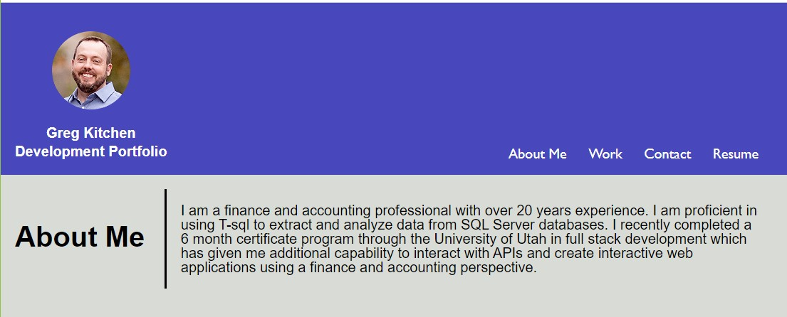

# Weekly Challenge 01 Horiseon Social Solutions Services Code Refactor

## URL to refactored web page

https://greg4949.github.io/challenge-week-1/

## Description

The purpose of this project was to refactor existing code for the web page of Horiseon Social Solutions Services.  The code was refactored to use more descriptive HTML elements, make sure they follow a logical structure, add in accessible alt attributes to images, add a concise descriptive title to title element, consolidate and organize CSS selectors and properties, and properly comment the CSS file. 

## Installation

N/A

## Usage

Web page can be accessed at the URL listed at the top of the README.  Clicking the navigation links at the upper right hand side of the page will take the user to specific areas of the web page that provide additional information on the service offered by Horiseon.

## Credits

N/A

## License

Please refer to the LICENSE in the repo.
